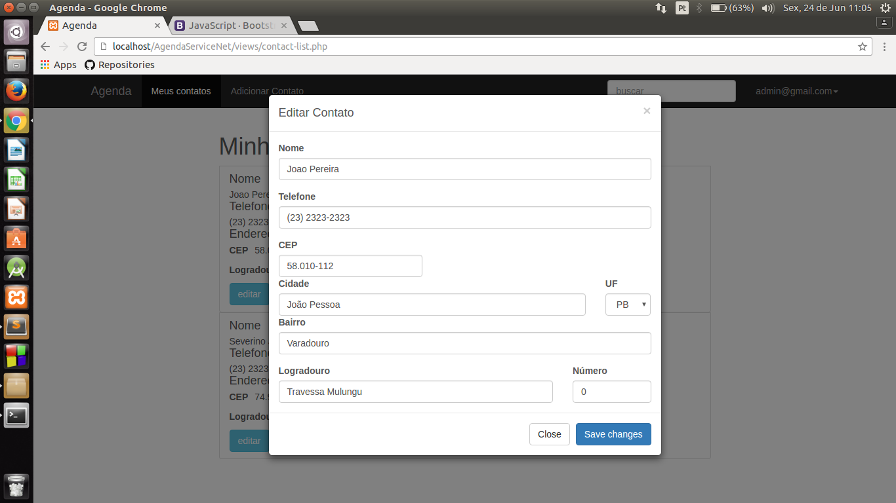

# AgendaServiceNet

1. Para executar o projeto você precisa ter o MySQL e o PHP instalados localmente na sua máquina. Para facilitar esse    processo foi utilizado o Xampp. XAMPP é completamente gratuito e fácil de instalar a distribuição Apache contendo MariaDB, PHP e Perl. O pacote de código aberto do XAMPP foi criada para ser extremamente fácil de instalar e de usar.(https://www.apachefriends.org/pt_br/index.html)

2. Agora vamos configuar o PDO no nosso PHP. PDO ou PHP Data Objects define uma interface consistente para acesso a banco de dados em PHP, ou seja, com o PDO podemos conectar não só ao MySQL mas também a muitos outros bancos como PostgreSQL, SQLServer, Oracle e assim por diante, basta utilizarmos o driver adequado.

    Habilitar o PDO

  Antes de começarmos a trabalhar com o PDO, é necessário habilitar o driver do PDO e o driver referente ao banco que será utilizado. Para habilitar o PDO é bem simples, vá ate o seu arquivo php.ini que encontra-se dentro do diretório onde foi instalado o PHP e remova os comentários (;) das linhas abaixo.

  - Habilitando PDO no Windows

  extension=php_pdo.dll
  extension=php_pdo_mysql.dll

 - Habilitando PDO no Linux

  extension=pdo.so
  extension=pdo_mysql.so

3. Abra o MySQL e execute o script sql: AgendaServiceNet/config/agendadb.sql. O script "agendadb.sql" vai criar toda a estrutura do banco de dados e vai inserir alguns dados.

4. Agora será necessário abrir o arquivo "AgendaServiceNet/config/dbconfig.php" e informar:
 - HOSTNAME: nome do servidor local.
 - DBNAME: nome do banco de dados que você criou.
 - DBUSER: nome do usuário do banco de dados.
 - DBPASS: senha do usuário do banco de dados.

5. Logando na aplicação.você pode logar na aplicação com os usuários:

email: admin@gmail.com - senha: 123
email: joao@gmail.com - senha: 123. 

<<<<<<< HEAD

=======
*****************************************************************************************************

>>>>>>> 0e814286c31b5a9071fffdec4a53c7750bc615ae
